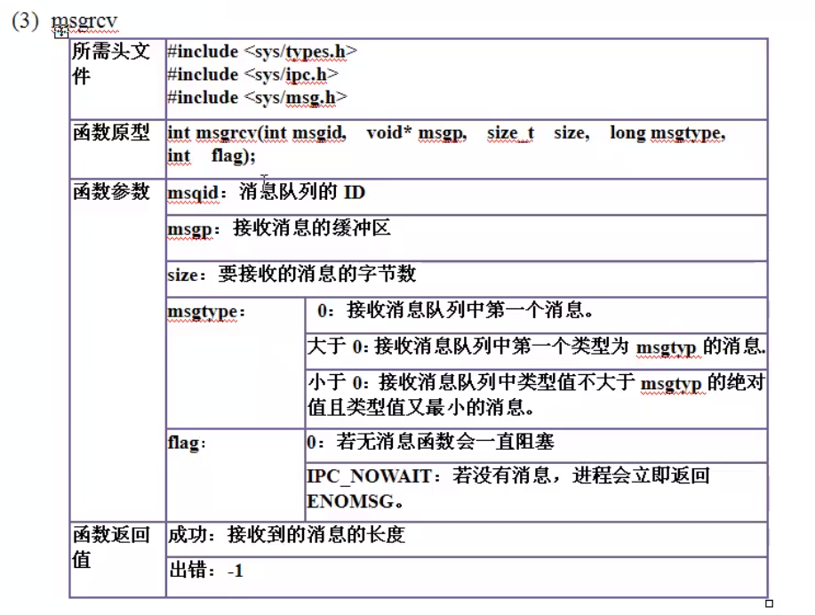

### 一、进程通信概述

#### 1. 进程通信、线程通信

进程通信：在用户空间实现进程通信 **<font color=FF0000>不可能</font>** ，需要通过 Linux 内核通信

线程通信：可以在用户空间实现，通过 **全局变量** 即可

```c
#include "unistd.h"
#include "stdio.h"
#include "sys/types.h"
#include "stdlib.h"

int main() {
    pid_t pid;
    int process_inter = 0;
    pid = fork();
    if (pid == 0) { // child process code second
        int i = 0;
        while (process_inter == 0);
        for (int i = 0; i < 5; i++) {
            printf("this is child process i = %d", i);
            usleep(100);
        }
    }
    if (pid > 0) { // parent process code first
    	int i = 0;
        for (int i = 0; i < 5; i++) {
            printf("this iparent process i = %d", i);
            usleep(100);
        }
        process_inter = 1;
    }
    return 0;
}
```

无法通过 **用户空间** 全局变量实现进程间通信，上段程序只能运行父进程。


----

#### 2. 进程通信方式

**单机模式** 下：（只有一个 Linux 内核）

- 管道通信：无名管道、有名管道（文件系统中有名）
- 信号通信：信号的发送、信号的接收和信号的处理
- IPC（Inter-Process Communication）：共享内存、消息队列和信号灯（量）

**多机模式** 下：（两个 Linux 内核）

- Socket 通信：存在于一个网络中两个进程之间的通信。

----

#### 3. 进程通信的学习思路

进程通信的学习思路：每一种通信方式都是基于文件IO的思想

- **`open`** ：创建或者打开进程通信对象。函数形式可能不同，可能有多个函数完成
- **`write`** ：向进程通信对象中写入内容。函数形式可能不同。
- **`read`** ：从进程通信对象中读取内容。函数形式可能不同。
- **`close`** ：关闭或删除进程通信对象。函数形式可能不同。

-----

### 二、无名管道

通信原理：


管道文件是一个特殊文件，是由 **队列** 来实现的。

#### 2.1 无名管道的创建

在文件IO中创建一个文件或打开一个文件是由 **`open`** 函数实现的，它不能创建管道文件。只能用 **`pipe`** 函数来创建管道。

**函数形式**： **`int pipe(int fd[2])`**

**功能**：创建管道，为系统调用， **`unistd.h`**

**参数**：就是得到的文件描述符。可见有两个文件描述符，**`fd[0]`** 、**`fd[1]`** ，管道有一个读端 **`fd[0]`** 用来读， **`fd[1]`** 用来写。

**返回值**：成功 0，失败 -1

----

#### 2.2 `pipe` 函数使用

```c
#include "unistd.h"
#include "stdio.h"
#include "stdlib.h"
int main(){
    int fd[2];
    int ret;
    char writebuf[] = "hello linux!";
    char readbuf[128] = {0};
    ret = pipe(fd);
    if (ret < 0) {
        printf("create pipe failure\n");
        return -1;
    } 
    printf("create pipe sucess fd[0] = %d, fd[1] = %d\n", fd[0], fd[1]);
    write(fd[1], writebuf, sizeof(writebuf));
    read(fd[0], readbuf, 128);
    printf("readbuf = %s\n", readbuf);
    return 0;  
}
```

**<font color = FF8888>注意</font>** :raising_hand:

- 管道是创建在内存中的， **进程结束，空间释放，管道就不再了** ；
- 管道中的东西， **读完了就删除了** ；
- 如果管道没有东西可读，就会 **阻塞** 。

----

#### 2.3 验证读阻塞

```c
#include "unistd.h"
#include "stdio.h"
#include "stdlib.h"
#include "string.h"
int main(){
    int fd[2];
    int ret;
    char writebuf[] = "hello linux!";
    char readbuf[128] = {0};
    ret = pipe(fd);
    if (ret < 0) {
        printf("create pipe failure\n");
        return -1;
    } 
    printf("create pipe sucess fd[0] = %d, fd[1] = %d\n", fd[0], fd[1]);
    write(fd[1], writebuf, sizeof(writebuf));
    read(fd[0], readbuf, 128);
    printf("readbuf = %s\n", readbuf);
    
    // second read from pipe
    // 会阻塞
    memset(readbuf, 0, 128);
    read(fd[0], readbuf, 128);
    printf("readbuf = %s\n", readbuf);
    
    close(fd[0]);
    close(fd[1]);
    return 0;  
}
```


----

#### 2.4 验证写阻塞

```c
#include "unistd.h"
#include "stdio.h"
#include "stdlib.h"
#include "string.h"
int main(){
    int fd[2];
    int ret;
    char writebuf[] = "hello linux!";
    char readbuf[128] = {0};
    ret = pipe(fd);
    if (ret < 0) {
        printf("create pipe failure\n");
        return -1;
    } 
    printf("create pipe sucess fd[0] = %d, fd[1] = %d\n", fd[0], fd[1]);
    int i = 0;
    // 可以通过 i 的设定，计算管道的大小
    while (i < 5500) {
        write(fd[1], writebuf, sizeof(writebuf));
        i++;
    }   
    printf("write pipe end\n"); 
    
    close(fd[0]);
    close(fd[1]);
    return 0;  
}
```


----

#### 2.5 实现进程通信。

~~~c
#include "unistd.h"
#include "stdio.h"
#include "sys/types.h"
#include "stdlib.h"

int main() {
    pid_t pid;
    char process_inter = 0;
    int fd[2];
    int ret;
    
    // 创建管道
    ret = pipe(fd);
    if (ret < 0) {
        printf("create pipe failure\n");
        return -1;
    } 
    printf("create pipe success\n");
    
    pid = fork();
    if (pid == 0) { // child process code second
        int i = 0;
        // if pipe empty  sleep
        //需要注意该process与父进程process同名而已
        while (process_inter == 0);
        for (int i = 0; i < 5; i++) {
            printf("this is child process i = %d", i);
            usleep(100);
        }
    }
    if (pid > 0) { // parent process code first
    	int i = 0;
        for (int i = 0; i < 5; i++) {
            printf("this iparent process i = %d", i);
            usleep(100);
        }
        process_inter = 1;
        write(fd[1], &process_inter, 1);
    }
    return 0;
}
~~~

可以实现进程间通信


----

### 三、有名管道

无名管道的 **<font color=FF000>缺点</font>** ：**不能实现不是父子进程（亲缘关系）之间的通信 。**

正由于这无名管道的缺点，对于无名管道进行改进，**有名管道。**

所谓的 **有名** ，即文件系统中存在这个一样文件节点，每一个文件节点都有一个 **`inode`** 号，而且这是一个特殊的文件类型： **`p`**  管道类型。

1.  **<font color=FF000>创建</font>** 这个文件节点，不可以通过 **`open`** 函数，**`open`** 函数只能创建普通文件，不能创建特殊文件（管道- **`mkfifo`** ，套接字- **`socket`** ，字符设备文件- **`mknod`** ，块设备文件- **`mknod`** ，符号链接文件-**`ln -s`**，目录文件- **`mkdir`** ）

2. 管道文件只有 **`inode`** 号，不占磁盘块空间，和套接字、字符设备文件、块设备文件一样。普通文件和符号链接文件及目录文件，不仅有 **`inode`** 号，还占有磁盘块空间

3.  **`mkfifo`** : 用来 **创建** 管道文件的 **节点**，**没有在内核中创建管道**。只有通过 **`open`** 函数 **打开这个文件时才会在内核空间创建管道**。

----

#### 3.1 有名管道的创建

**`mkfifo` 的用法**

**函数形式:  `int mkfifo(const char* filename, mode_t mode);`** 创建管道文件。

**参数**：管道文件名，权限，创建的文件权限任然和 **`umask`** 有关系

**返回值**：创建成功返回 0，失败返回 -1。

```c
#include "stdio.h"
#include "unistd.h"
#include "stdlib.h"
int main() {
    int ret;
    ret = mkfifo("./myfifo", 0777); // 权限 0777
    if (ret < 0) {
        printf("create myfifo failure \n");
        return -1;
    }
    printf("create myfifo success \n");
    return 0;
}
```

----

#### 3.2 通过管道实现无亲缘关系进程间通信

**`first.c`**

~~~c
#include "unistd.h"
#include "stdio.h"
#include "stdlib.h"
#include "sys/types.h"
#include "fcntl.h"
int main() {
    int fd;
    char process_inter = 0;
    // 打开之前创建的管道类型文件
    fd = open("./myfifo", O_WRONLY);
    if (fd < 0) {
        printf("open myfifo failure\n");
        return -1;
    }
    printf("open myfifo success \n");
    int i;
    for (i = 0; i < 5; i++) {
        printf("this is first process i = %d\n", i);
        usleep(100);
    }
    process_inter = 1;
    sleep(3);
    // 向管道中写
    write(fd, &process_inter, 1);
    while(1);
    return 0;
}
~~~

**`second.c`**

~~~c
#include "unistd.h"
#include "stdio.h"
#include "stdlib.h"
#include "sys/types.h"
#include "fcntl.h"
int main() {
    int fd;
    char process_inter = 0;
    fd = open("./myfifo", O_RDONLY);
    if (fd < 0) {
        printf("open myfifo failure\n");
        return -1;
    }
    printf("open myfifo success \n");
    // 从管道中读
    read(fd, &process_inter, 1);
    while (process_inter == 0);
    for (int i = 0; i < 5; i++) {
        printf("this is second process i = %d\n", i);
        usleep(100);
    }
    while(1);
    return 0;
}
~~~

先运行 **`first`**  **open** 管道文件：**`myfifo `**


运行 **`second`** ，此时两端开始通信，**`first`** 先运行，**`second`** 后运行

 

----

### 四、信号通信

信号通信，其实就是内核向用户空间进程 **<font color=FF0000>发送信号</font>** ，只有**<font color=FF0000>内核才能发信号</font>**，用户空间进程不能发信号。

内核可以发送 **多少种** 信号？**`kill -l`** :  **64 种** ，常见命令：**`kill 9 pid`**  (杀死进程)

信号通信的框架

- 信号的发送（发送信号进程）： **`kill` <font color=FF0000>`raise`</font> `alarm`**
- 信号的接收（接收信号进程）： **`pause()`  `sleep`  `while(1)`**
- 信号的处理（接收信号进程）： **`signal`**

#### 4.1 信号的发送（发送信号进程）

##### 4.1.1 **`kill`**  


**例子：编写自己的kill函数**

创建一个简单的进程 **`test.c`**

```c
#include "stdio.h"
int main() {
    // 死循环
    while (1);
    return 0;
}
```
运行后系统死循环


**`mykill.c`**

```c
#include "sys/types.h"
#include "signal.h"
#include "unistd.h"
#include "stdio.h"
#include "stdlib.h"

int main(int argc, char *argv[]) {
    int sig;
    int pid;
    if (argc < 3) {
        printf("please input param\n");
        return -1;
    }
    sig = atoi(argv[1]);
    pid = atoi(argv[2]);
    printf("sig = %d, pid = %d \n", sig, pid);
    // 调用系统函数
    kill(pid, sig);
    return 0;
}
```

使用 **9** 号信号量 **`SIGKILL`** 来 **kill** 掉 **`./test`** 进程


----

##### 4.1.2 raise

**`raise`** : 发信号给自己，等价于  **`kill(getpid(), sig)`**


**例子：raise 函数**

**`raise.c`**

```c
#include "stdio.h"
#include "sys/types.h"
#include "signal.h"
#include "stdlib.h"
int main() {
    printf("raise before");   // 输出结果见1图，它只是将该语句写入库函数缓存，没有写入内核
    // printf("raise before\n");  // 输出结果见2图
    raise(9); // 相当于_exit()，而非exit();
    printf("raise after\n");
    return 0;
}
```


**`raise_2.c`**

```c
#include "stdio.h"
#include "sys/types.h"
#include "signal.h"
#include "stdlib.h"
#include "unistd.h"
int main() {
    pid_t pid;
    pid = fork();
    if (pid > 0) {
        sleep(8);
        while(1);
    }
    if (pid == 0) {
    	printf("raise function before\n");
        raise(SIGTSTP); // 进程进入暂停状态（T）
        printf("raise function after\n");
        exit(0);
    }
    return 0;
}
```

程序运行后，首先子进程输出语句


之后调用 **`raise`** 函数进入暂停状态，此时父进程睡眠状态 **`S `**，子进程暂停状态 **`T`**


父进程睡眠 8 秒后，父进程进入运行状态 **`R`** ，此时子进程仍然是暂停状态 **`T`**


稍微修改一下 **`raise_2.c`**

```c
#include "stdio.h"
#include "sys/types.h"
#include "signal.h"
#include "stdlib.h"
#include "unistd.h"
int main() {
    pid_t pid;
    pid = fork();
    if (pid > 0) {
        sleep(8);
        if (waitpid(pid, NULL, WNOHANG) == 0) {
            kill(pid, 9); // 杀死子进程，此时父进程没有对其进行回收资源(wait)
            			  // 子进程会变成僵尸进程
        }
        // wait(NULL); // 加上 wait 函数回收子进程资源，子进程就不会变成僵尸进程
        while(1);
    }
    if (pid == 0) {
    	printf("raise function before\n");
        raise(SIGTSTP); // 进程进入暂停状态（T）
        printf("raise function after\n");
        exit(0);
    }
    return 0;
}
```

程序运行后，首先子进程输出语句


之后调用 **`raise`** 函数进入暂停状态，此时父进程睡眠状态 **`S `**，子进程暂停状态 **`T`**


父进程睡眠 8 秒后，父进程进入运行状态 **`R`** ，此时子进程进入僵尸状态 **`Z`**


加上 **`wait()`** 子进程被 **`kill`** 后不会变成僵尸进程


----

##### 4.1.3 `alarm` 

**`alarm`** 与 **`raise`** 的比较：

- **相同点** ：让内核发送信号给当前进程

- **不同点** ：
- **`alarm`** 只会发送 **`SIGALARM`** 信号 (**14** 号信号)
  
- **`alarm`** 会让内核 **定时** 一段时间之后发送信号， **` raise`** 会让内核 **立刻** 发信号


**例子：alarm** 

**`alarm.c`**

```c
#include "stdio.h"
#include "sys/types.h"
#include "signal.h"
#include "stdlib.h"
#include "unistd.h"
int main() {
    printf("alarm before\n");   
    alarm(9);
    printf("alarm before\n");
    int i = 0;
    while (i < 20) {
        i++;
        sleep(1);
        printf("process things, i = %d \n", i);
    }
    return 0;
}
```

运行结果如下所示，**`alarm`** 在 9 秒后终止操作


----

#### 4.2 信号的接收（接收信号进程）

接收信号的进程的条件：要想使接收的进程能接收信号，这个进程不能结束

- **`sleep`**

- **`while(1)`**
- **`pause`** 进程状态为 **`S`**


**`pause.c`**

```c
#include "stdio.h"
#include "sys/types.h"
#include "signal.h"
#include "stdlib.h"
#include "unistd.h"
int main() {
    printf("pause before \n");
    pause();
    printf("pause after \n");
    int i = 0;
    while (i < 20) {
        i++;
        sleep(1);
        printf("process things, i = %d", i);
    }
    return 0;
}
```

运行程序后，进程处于睡眠状态 **`S`**


----

#### 4.3 信号的处理（接收信号进程）

收到信号的进程，应该怎样处理？处理的方式：

（1）进程的 **默认** 处理方式（内核为用户进程设置的默认处理方式）：

- 忽略
- 终止进程
- 暂停

（2）自定义的处理方式：自定义处理信号的方法告诉内核，这样线程收到了这个信号就会采用自定义的处理方式


**`signal`** 函数有两个参数，

- 第一个参数是一个整形变量（信号值），

- 第二个参数是一个函数指针，是自定义的处理函数，这个函数的返回值是一个函数指针。

----

##### 4.3.1 自定义处理

**`signal.c`**

```c
#include "stdio.h"
#include "sys/types.h"
#include "signal.h"
#include "stdlib.h"
#include "unistd.h"
void myfun(int signum) {
    int i = 0;
    while (i < 10) {
        printf("process signal signum = %d, i = %d\n", signum);
        sleep(1);
        i++;
    }
    return; // return main
}
int main() {
    signal(14, myfun);
    printf("alarm before \n");
    alarm(9);
    printf("alarm after \n");
    int i = 0;
    while (i < 20) {
        i++;
        sleep(1);
        printf("process things, i = %d\n", i);
    }
    return 0;
}
```

 **`signal(14, myfun);`** 表示接收到 14 号信号，进行自定义的一些处理（**14号信号 --> alarm**）

程序运行，9秒后发送 **`alarm`** 信号，期间进程一直运行


接收到 **`alarm`** 信号后，处理 **`myfun`**


处理 **`myfun`** 结束后，重新回到 **`main`** 中继续进行剩下的操作


----

##### 4.3.2 `SIG_IGN` ,  `SIG_DFL`

```c
#include "stdio.h"
#include "sys/types.h"
#include "signal.h"
#include "stdlib.h"
#include "unistd.h"
void myfun(int signum) {
    int i = 0;
    while (i < 10) {
        printf("process signal signum = %d", signum);
        sleep(1);
        i++;
    }
    return; // return main
}
int main() {
    signal(14, myfun);
    printf("alarm before \n");
    alarm(9);
    printf("alarm after \n");
    signal(14, SIG_IGN);  // 又一次接收到信号，忽略它，不会处理myfun，也不会终止运行
    // signal(14, SIG_DFL);  // 默认处理，9秒后终止
    int i = 0;
    while (i < 20) {
        i++;
        sleep(1);
        printf("process things, i = %d", i);
    }
    return 0;
}
```

**`SIG_IGN`** ,                                                                           **`SIG_DFL`**


----

#### 4.4 signal 处理进程间通信

```c
#include "stdio.h"
#include "sys/types.h"
#include "signal.h"
#include "stdlib.h"
#include "unistd.h"

void myfun(int signum) {
    int i = 0;
    while (i < 5) {
        printf("receive signum = %d, i = %d\n", signum, i);
        sleep(1);
        i++;
    }
    return ;
}
int main() {
    pid_t pid;
    pid = fork();
    if (pid > 0) {
        int i = 0;
        signal(10, myfun);
        while (1) {
            printf("parent process things, i = %d\n", i);
            sleep(i);
            i++;
        }
    }
    if (pid == 0) {
    	sleep(10);
        kill(getppid(), 10);    // SIGUSER1  10 信号
        sleep(10);
        exit(0);
    }
    return 0;
}
```

父进程死循环打印输出，子进程睡眠 10 s 后发送 10 号 **`SIGUSER1`** 信号，父进程接收到信号就会跳入处理自定义函数 **`myfun`** ，处理结束后基于死循环打印输出。结果如下：


此时进程状态如下，父进程运行状态( **`R`** )，子进程僵尸状态 ( **`Z`** ) ，需要父进程进行资源回收处理。


因为 **`wait()`** 操作为阻塞操作，不能直接放在处理函数之上，这会导致处理函数不会进行下去。

```c
if (pid > 0) {
        int i = 0;
        signal(10, myfun);
    	wait(NULL); // 放在这里会阻塞后续处理。
        while (1) {
            printf("parent process things, i = %d\n", i);
            sleep(i);
            i++;
        }
    }
```

由结果可以知道，父进程开始会处于 **<font color=FF000>阻塞状态</font>** ，只有接收 10 号信号后才会处理 **`myfun`** ，之后 **<font color=FF000>等子进程退出</font>** ，之后才会处理 **`printf`** 操作


因为 **`exit(0)`** 发送了 **`kill SIGCHLD`** 信号，**17 号信号** ，所以父进程可以接收 17 信号后处理 **`wait`** 即可

```c
void myfun1(int signum) {
    printf("receive signum = %d\n",signum);
    wait(NULL);
    return;
}
if (pid > 0) {
        int i = 0;
        signal(10, mufun);
    	signal(17, myfun1);
        while (1) {
            printf("parent process things, i = %d\n", i);
            sleep(i);
            i++;
        }
    }
```

这样的话，在子进程结束之后，就不会产生僵尸进程


     

----

### 五、IPC 通信


常用的 IPC 相关的 **`shell`** 命令

查看 IPC 对象 ： **`ipcs`  `-m`**   (共享内存)    **` -q`**  (消息队列)     **`-s`**  (信号灯)

删除 IPC 对象：**`ipcrm`  `-m`**   (共享内存)   \    **`-q `** (消息队列)  \    **`-s`**  (信号灯)    **`id`**

返回值：**共享内存** ， **消息队列** ， **信号灯** 标识符，IPC 的 ID 号

每次用 **`IPC_PRIVATE`** 操作时， **`key`**  都是一样的，都是 0

----

### 六、共享内存

#### 6.1 创建和打开共享内存

**`shmget`** 函数


                                         出错：返回 - 1

**`shmget.c`**

```c
#include "sys/types.h"
#include "sys/shm.h"
#include "signal.h"
#include "unistd.h"
#include "stdio.h"
#include "stdlib.h"
int main() {
    int shmid;
    shmid = shmget(IPC_PRIVATE, 128, 0777);
    if (shmid < -1) {
        printf("create share memory failure\n");
        return -1;
    }
    printf("creat share memory success shmid = %d\n", shmid);
    system("ipcs -m");
    // system("ipcrm -m shmid");
    return 0;
}
```

每次运行一次，创建一个共享内存，下图运行三次后。


使用 **`ipcrm -m id`** 删除后两个共享内存


----

#### 6.2 ftok 函数，创建 key 值

**`char ftok(const char* path, char key)`**

- **参数** ：第一个参数：文件路径和文件名；第二个参数：一个字符

- **返回值** ：正确返回一个 key 值，出错返回 -1

**`IPC_PRIVATE`** 操作时，共享内存的 key 值都是一样，都是 **0** ， 所以对于非亲缘关系进程使用 **`ftok`** 来创建 key 值。只要 key 值是一样的，用户空间的进程通过这个函数打开，则会对内核的同一个 IPC 对象操作。

**`shmget.c`**

```c
#include "sys/types.h"
#include "sys/shm.h"
#include "signal.h"
#include "unistd.h"
#include "stdio.h"
#include "stdlib.h"
int main() {
    int shmid;
    int key;
    key = ftok("./a.c", 'a');
    if (key < 0) {
        printf("create key failure\n");
        return -2;
    }
    printf("create key success, key = %X\n", key);
    shmid = shmget(key, 128, IPC_CREAT | 0777);  // 需要在权限处加上宏 TPC_CREAT
    // shmid = shmget(IPC_PRIVATE, 128, 0777); 对比
    if (shmid < -1) {
        printf("create share memory failure\n");
        return -1;
    }
    printf("creat share memory success shmid = %d\n", shmid);
    system("ipcs -m");
    // system("ipcrm -m shmid");
    return 0; 
}
```

结果如下：之前用 **`IPC_PRIVATE`** 创建的 key = 0，现在用自定义的 key


----

#### 6.3 将共享内存映射到用户空间中

为了方便用户空间对共享内存的操作，使用地址映射的方式。利用 **`shmat`**  函数。

**`void *shmat (int shmid, const void * shmaddr, int shmflg);`**

**参数**：

- 第一个参数：ID号；

- 第二个参数：映射到的地址，**NULL** 为系统自动完成的映射；

- 第三个参数：`shmflg`  
  - **`SHM_RDONLY`**共享内存只读
  - 默认 0，表示共享内存可读写

返回值： 成功：映射后的地址；失败：**NULL**

**`shmat.c`**

```c
#include "sys/types.h"
#include "sys/shm.h"
#include "signal.h"
#include "unistd.h"
#include "stdio.h"
#include "stdlib.h"
int main() {
    int shmid;
    int key;
    char *p;
    key = ftok("./a.c", 'a');
    if (key < 0) {
        printf("create key failure\n");
        return -1;
    }
    printf("create key success, key = %X\n", key);
    shmid = shmget(key, 128, IPC_CREAT | 0777); 
    // shmid = shmget(IPC_PRIVATE, 128, 0777); 对比
    if (shmid < -1) {
        printf("create share memory failure\n");
        return -2;
    }
    printf("creat share memory success shmid = %d\n", shmid);
    system("ipcs -m");
    
    p = (char *)shmat(shmid, NULL, 0);
    if (p == NULL) {
        printf("shmat function failure\n");
        return -3;
    }
    // write share memory
    // stdin:键盘输入，128字节，写入 p 中
    fgets(p, 128, stdin);
    
    // start read share memory
    printf("share memory data: %s\n", p);
    // printf("share memory data: %s\n", p);
    
    return 0;
}
```

程序运行后，键盘输入: test 进共享内存，后读数据输出


**与管道不同 **，共享内存中的数据在读取后 **并没有被删除** ，两条输出语句的结果如下：


**共享内存特点：**

- 共享内存创建后，一直存在于内核中，知道被删除或系统关闭；
- 共享内存和管道不一样，读取后，内容仍在其共享内存中。

----

#### 6.4 删除进程里的地址映射

使用 **`shmdt`** 函数，删除用户空间的地址映射

**`int shmdt(const void* shmaddr);`**

**参数** ：**`shmaddr`** ：共享内存映射后的地址（用户空间）

**返回值** ：成功：0； 失败： -1

**`shmdt.c`**

```c
#include "sys/types.h"
#include "sys/shm.h"
#include "signal.h"
#include "unistd.h"
#include "stdio.h"
#include "stdlib.h"
#include "string.h"
int main() {
    int shmid;
    int key;
    char *p;
    key = ftok("./a.c", 'a');
    if (key < 0) {
        printf("create key failure\n");
        return -2;
    }
    printf("create key success, key = %X\n", key);
    shmid = shmget(key, 128, IPC_CREAT | 0777); 
    // shmid = shmget(IPC_PRIVATE, 128, 0777); 对比
    if (shmid < -1) {
        printf("create share memory failure\n");
        return -1;
    }
    printf("creat share memory success shmid = %d\n", shmid);
    system("ipcs -m");
    
    p = (char *)shmat(shmid, NULL, 0);
    if (p == NULL) {
        printf("shmat function failure\n");
        return -3;
    }
    // write share memory
    // stdin:键盘输入，128字节，写入 p 中
    fgets(p, 128, stdin);
    
    // start read share memory
    printf("share memory data: %s\n", p);
    printf("share memory data: %s\n", p);
    
    // 释放用户空间共享内存
    shmdt(p);
    memcpy(p, "abcd", 4);
    
    return 0;
}
```

共享内存释放后，不能再次使用它，所以 **`memcpy`** 函数操作会出现段错误。


----

#### 6.5 shmctl：删除共享内存对象

**`int shmctl(int shmid, int cmd, struct shmid_ds *buf)`**

**参数** ：

- **`shmid`** ：要操作的共享内存标识符
- **`cmd`** ：
  -  **`IPC_STAT`**   (获取对象属性)   -- 实现了 **`ipcs - m`**
  -  **`IPC_SET`**   （设置对象属性）
  -  **`IPC_RMID`**  (删除对象)            -- 实现了 **`ipcrm -m id`** 

- **`buf`** : 指定 **`IPC_STAT/IPC_SET`** 时可以保存 / 设置属性。

**返回值**：成功：0； 失败：-1；

**`shmctl.c`**

```c
#include "sys/types.h"
#include "sys/shm.h"
#include "signal.h"
#include "unistd.h"
#include "stdio.h"
#include "stdlib.h"
#include "string.h"
int main() {
    int shmid;
    int key;
    char *p;
    key = ftok("./a.c", 'a');
    if (key < 0) {
        printf("create key failure\n");
        return -2;
    }
    printf("create key success, key = %X\n", key);
    shmid = shmget(key, 128, IPC_CREAT | 0777); 
    // shmid = shmget(IPC_PRIVATE, 128, 0777); 对比
    if (shmid < -1) {
        printf("create share memory failure\n");
        return -1;
    }
    printf("creat share memory success shmid = %d\n", shmid);
    system("ipcs -m");
    
    p = (char *)shmat(shmid, NULL, 0);
    if (p == NULL) {
        printf("shmat function failure\n");
        return -3;
    }
    // write share memory
    // stdin:键盘输入，128字节，写入 p 中
    fgets(p, 128, stdin);
    
    // start read share memory
    printf("share memory data: %s\n", p);
    printf("share memory data: %s\n", p);
    
    // 释放用户空间共享内存
    shmdt(p);
    // memcpy(p, "abcd", 4);
    
    // 删除共享内存对象
    shmctl(shmid, IPC_RMID, NULL);
    
    system("ipcs -m");// 查看共享内存还在不在
    
    return 0;
}
```

运行程序，键盘输入 test ，结果打印两遍后删除共享内存对象，发现 **`shmid = 3`** 的共享内存被删除。


**`myipcrm.c`**

```c
#include "sys/types.h"
#include "sys/shm.h"
#include "signal.h"
#include "unistd.h"
#include "stdio.h"
#include "stdlib.h"
#include "string.h"
int main(int argc, char* argv[]) {
    int shmid;
    if (argc < 3) {
        printf("please input param\n");
        return -1;
    }
    if (strcmp(argv[1], "-m") == 0) {
        printf("delete share memory\n");
    } else {
        return -2;
    }
    shmid = atoi(argv[2]);
    printf("shmid = %d\n", shmid);
    shmctl(shmid, IPC_RMID, NULL);
    system("ipcs -m");

    return 0;
}
```

自己创建的 **`ipcrm -m id`** 操作，成功的删除了 **`shmid = 0`** 的共享内存


----

#### 6.6 有亲缘关系的进程（IPC_PRIVATE）

**`shmctl_2.c `**

```c
#include "sys/types.h"
#include "sys/shm.h"
#include "signal.h"
#include "unistd.h"
#include "stdio.h"
#include "stdlib.h"
#include "string.h"

// 信号处理函数，不需要任何处理，主要为了唤醒 pause 函数，且避免 sigusr1/2终止函数
void myfun(int signum) {return;}

int main() {
    int shmid;
    int key;
    char* p;
    int pid;
    shmid = shmget(IPC_PRIVATE, 128, IPC_CREAT | 0777);
    if (shmid < 0) {
        printf("creat share memory failure\n");
        return -1;
    }
    printf("creat memory success shmid = %d\n", shmid);
    
    // shmget 在 fork 之前
    pid = fork();
    if (pid > 0) {
        signal(SIGUSR2, myfun);
        p = (char *)shmat(shmid, NULL, 0);
        if (p == NULL) {
            printf("shmat function failure\n");
            return -2;
        }
        while(1) {
            // write share memory
            printf("parent process start write share memory: \n");
            fgets(p, 128, stdin);
            kill(pid, SIGUSR1); // 通知子进程去读
            pause(); // 等待子进程去读
        }
    }
    if (pid == 0) {
        signal(SIGUSR1, myfun);
        p = (char *) shmat(shmid, NULL, 0);
        if (p == NULL) {
            printf("shmat function failure\n");
            return -3;
        }
        while(1) {
            pause(); // 等待父进程去写
        	printf("share memory data: %s\n", p);
            kill(getppid(), SIGUSR2);
        }
    }
    return 0;
}
```

程序运行，父进程写，子进程读取，两个进程状态都是睡眠状态 （**`S`**）


----

#### 6.7 无亲缘关系的进程（key）

**`server.c `**

```c
#include "sys/types.h"
#include "sys/shm.h"
#include "signal.h"
#include "unistd.h"
#include "stdio.h"
#include "stdlib.h"
#include "string.h"

struct mybuf{
    int pid;
    char buf[124];
};

// 信号处理函数，不需要任何处理，主要为了唤醒 pause 函数，且避免 sigusr1/2终止函数
void myfun(int signum) {return;}

int main() {
    int shmid;
    int key;
    struct mybuf* p;
    int pid;
    // 创建 key
    key = ftok("./a.c",'c');
    if (key < 0) {
        printf("create key failure\n");
        return -1;
    }
    printf("create key success, key = %X\n", key);
    // 创建 share memory
    shmid = shmget(key, 128, IPC_CREAT | 0777);
    if (shmid < 0) {
        printf("creat share memory failure\n");
        return -2;
    }
    printf("creat memory success shmid = %d\n", shmid);
	// 信号处理
    signal(SIGUSR2, myfun);
    // 地址映射
    p = (struct mybuf*)shmat(shmid, NULL, 0);
    if (p == NULL) {
        printf("shmat function failure\n");
        return -3;
    }
    // get client pid
    p->pid = getpid(); // write server pid to share memory
    pause(); //wait client read server pid;
    pid = p->pid;
    
    while(1) {
        // write share memory
        printf(" process start write share memory: \n");
        fgets(p->buf, 128, stdin);
        kill(pid, SIGUSR1); // 通知client进程去读
        pause(); // 等待client 进程去读
    }    
    return 0;
}
```

**`client.c `**

```c
#include "sys/types.h"
#include "sys/shm.h"
#include "signal.h"
#include "unistd.h"
#include "stdio.h"
#include "stdlib.h"
#include "string.h"

struct mybuf{
    int pid;
    char buf[124];
};

// 信号处理函数，不需要任何处理，主要为了唤醒 pause 函数，且避免 sigusr1/2终止函数
void myfun(int signum) {return;}

int main() {
    int shmid;
    int key;
    struct mybuf* p;
    int pid;
    // 创建 key
    key = ftok("./a.c",'c');
    if (key < 0) {
        printf("create key failure\n");
        return -1;
    }
    printf("create key success, key = %X\n", key);
    // 创建 share memory
    shmid = shmget(key, 128, IPC_CREAT | 0777);
    if (shmid < 0) {
        printf("creat share memory failure\n");
        return -2;
    }
    printf("creat memory success shmid = %d\n", shmid);  
    // 信号处理
    signal(SIGUSR1, myfun);
    // 地址映射
    p = (struct mybuf*)shmat(shmid, NULL, 0);
    if (p == NULL) {
        printf("shmat function failure\n");
        return -3;
    }
      
    // get server pid
    // read share memory
    pid = p->pid;
    // write client pid to share memory
    p->pid = getpid();
    kill(pid, SIGUSR2);
    
    // client start read data from share memory
    
    while(1) {
        pause(); // wait server write data to share memory;
        printf("client process receive data from share memory: %s", p->buf);
        kill(pid, SIGUSR2); // server may write share memory
    }    
    return 0;
}
```

该程序的关键是：要先通过共享内存交互双方的 **`pid`**;

运行服务器，客户端程序，可以发现双方都可以操作 **`shmid = 8`** 的共享内存，服务器端发送多次发送数据，客户端多次接受数据；服务器每次发送完，等待下一次输入；客户端每次接受，等待下一次服务器的消息发送。

结果如下：


----

### 七、消息队列

链式队列


**`msqid_ds`**  内核维护消息队列的结构体，队列的第一个消息指针 **`msg_first`**，最后一个消息指针 **`msg_last`** ，消息中有一个成员指针 **`next`**

每一个消息中包含有哪些内容：

- Data ：数据
- Length：数据的长度
- Type：数据的类型


----

#### 7.1 消息队列的创建和打开


**`msgget.c`**

```c
#include "sys/types.h"
#include "sys/msg.h"
#include "signal.h"
#include "unistd.h"
#include "stdio.h"
#include "stdlib.h"

int main() {
    int msgid;
    msgid = msgget(IPC_PRIVATE,0777);
    if (msgid < 0) {
        printf("create message queue failure\n");
        return -1;
    }
    printf("create message queue success, msgid = %d\n", msgid);
    system("ipcs -q");
    
    return 0;
}
```

三次运行程序创建了三个消息队列


----

#### 7.2 消息队列控制


**`msgctl.c`**

```c
#include "sys/types.h"
#include "sys/msg.h"
#include "signal.h"
#include "unistd.h"
#include "stdio.h"
#include "stdlib.h"

int main() {
    int msgid;
    msgid = msgget(IPC_PRIVATE,0777);
    if (msgid < 0) {
        printf("create message queue failure\n");
        return -1;
    }
    printf("create message queue success, msgid = %d\n", msgid);
    system("ipcs -q");
    
    // delete message queue
    msgctl(msgid, IPC_RMID, NULL);
    system("ipcs -q");
    
    return 0;
}
```

程序运行，先创建一个 **`msgid = 3`** 消息队列，之后删除它


----

#### 7.3 消息发送


**`msgsnd.c`**

```c
#include "sys/types.h"
#include "sys/msg.h"
#include "signal.h"
#include "unistd.h"
#include "stdio.h"
#include "stdlib.h"

struct msgbuf {
    long type;
    char voltage[124];
    char ID[4];
};

int main() {
    int msgid;
    struct msgbuf sendbuf;
    msgid = msgget(IPC_PRIVATE,0777);
    if (msgid < 0) {
        printf("create message queue failure\n");
        return -1;
    }
    printf("create message queue success, msgid = %d\n", msgid);
    system("ipcs -q");
    
    // init sendbuf
    sendbuf.type = 100;
    printf("please input message:\n");
    fgets(sendbuf.voltage, 124, stdin);
    
    // start write message to message queue
    msgsnd(msgid, (void *)&sendbuf, strlen(sendbuf.voltage), 0);
    
    while(1);
    
    // delete message queue
    msgctl(msgid, IPC_RMID, NULL);
    system("ipcs -q");
    
    return 0;
}
```

----

#### 7.4 消息接收



**`msgrcv.c`**

```c
#include "sys/types.h"
#include "sys/msg.h"
#include "signal.h"
#include "unistd.h"
#include "stdio.h"
#include "stdlib.h"
#include "string.h"

struct msgbuf {
    long type;
    char voltage[124];
    char ID[4];
};

int main() {
    int msgid;
    struct msgbuf sendbuf;
    struct msgbuf recvbuf;
    int readret;
    msgid = msgget(IPC_PRIVATE,0777);
    if (msgid < 0) {
        printf("create message queue failure\n");
        return -1;
    }
    printf("create message queue success, msgid = %d\n", msgid);
    system("ipcs -q");
    
    // init sendbuf
    sendbuf.type = 100;
    printf("please input message:\n");
    fgets(sendbuf.voltage, 124, stdin);
    
    // start write message to message queue
    msgsnd(msgid, (void *)&sendbuf, strlen(sendbuf.voltage), 0);
    
    // start read message from message queue
    memset(recvbuf.voltage, 0, 124);
    readret = msgrcv(msgid, (void *)&recvbuf, 124, 100, 0);
    printf("recv: %s, readret = %d\n", recvbuf.voltage, readret);
    // 第二次读
    // msgrcv(msgid, (void *)&recvbuf, 124, 100, 0);
    // printf("recv: %s\n", recvbuf.voltage);
    
    // delete message queue 
    msgctl(msgid, IPC_RMID, NULL);
    system("ipcs -q");
    
    return 0;
}
```

程序运行，键盘写入消息，然后在读取消息打印输出


如果两次读取则会发生错误，程序或阻塞，因为读取后消息被删除，读函数阻塞等待


----

#### 7.5 单向读写操作

**`write.c`**

```c
#include "sys/types.h"
#include "sys/msg.h"
#include "signal.h"
#include "unistd.h"
#include "stdio.h"
#include "stdlib.h"
#include "string.h"

struct msgbuf {
    long type;
    char voltage[124];
    char ID[4];
};

int main() {
    int msgid;
    struct msgbuf sendbuf;
    struct msgbuf recvbuf;
    int readret;
    int key;
    key = ftok("./a.c", 'c');
    if (key < 0) {
        printf("creat key failure\n");
        return -1;
    }
    msgid = msgget(key,IPC_CREAT | 0777);
    if (msgid < 0) {
        printf("create message queue failure\n");
        return -1;
    }
    printf("create message queue success, msgid = %d\n", msgid);
    system("ipcs -q");
    
    sendbuf.type = 100;
    // write message queue
    while (1) {
        // init sendbuf
        memset(sendbuf.voltage, 0, 124);
        
        printf("please input message:\n");
        fgets(sendbuf.voltage, 124, stdin);
        
        // start write message to message queue
    	msgsnd(msgid, (void *)&sendbuf, strlen(sendbuf.voltage), 0);
    }
    
    // delete message queue 
    msgctl(msgid, IPC_RMID, NULL);
    system("ipcs -q");
    
    return 0;
}
```

**`read.c`**

```c
#include "sys/types.h"
#include "sys/msg.h"
#include "signal.h"
#include "unistd.h"
#include "stdio.h"
#include "stdlib.h"
#include "string.h"

struct msgbuf {
    long type;
    char voltage[124];
    char ID[4];
};

int main() {
    int msgid;
    struct msgbuf sendbuf;
    struct msgbuf recvbuf;
    int readret;
    int key;
    key = ftok("./a.c", 'c');
    if (key < 0) {
        printf("creat key failure\n");
        return -1;
    }
    msgid = msgget(key,IPC_CREAT | 0777);
    if (msgid < 0) {
        printf("create message queue failure\n");
        return -1;
    }
    printf("create message queue success, msgid = %d\n", msgid);
    system("ipcs -q");
    
    // read message queue
    while (1) {
        // init recvbuf
        memset(recvbuf.voltage, 0, 124);
        
        // start read message to message queue
    	msgrcv(msgid, (void *)&recvbuf, 124, 100, 0);
        printf("receive data from message queue: %s\n", recvbuf.voltage);
    }
    
    // delete message queue 
    msgctl(msgid, IPC_RMID, NULL);
    system("ipcs -q");
    
    return 0;
}
```

程序运行后，**`write.c`** 写消息，**`read.c`** 读消息 (该例子与上一章最后一个例子相似)


----

#### 7.6 双向通信

**`server.c`**

```c
#include "sys/types.h"
#include "sys/msg.h"
#include "signal.h"
#include "unistd.h"
#include "stdio.h"
#include "stdlib.h"
#include "string.h"

struct msgbuf {
    long type;
    char voltage[124];
    char ID[4];
};

int main() {
    int msgid;
    struct msgbuf sendbuf;
    struct msgbuf recvbuf;
    int readret;
    int pid;
    int key;
    key = ftok("./b.c", 'c');
    if (key < 0) {
        printf("creat key failure\n");
        return -1;
    }
    msgid = msgget(key,IPC_CREAT | 0777);
    if (msgid < 0) {
        printf("create message queue failure\n");
        return -2;
    }
    printf("create message queue success, msgid = %d\n", msgid);
    system("ipcs -q");
    
    // 在消息队列创建之后，使用 fork 函数
    pid = fork();
    // parent process write type:100 Data
    if (pid > 0) {
        sendbuf.type = 100;
    	// write message queue
   		while (1) {
        	// init sendbuf
        	memset(sendbuf.voltage, 0, 124);
        
        	printf("please input message:\n");
        	fgets(sendbuf.voltage, 124, stdin);
        
        	// start write message to message queue
    		msgsnd(msgid, (void *)&sendbuf, strlen(sendbuf.voltage), 0);
    	}
    } 
    // child process read type:200 Data
    if (pid == 0) {
        while (1) {
        	memset(recvbuf.voltage, 0, 124);
       	 	msgrcv(msgid, (void *)&recvbuf, 124, 200, 0);
        	printf("receive from message queue: %s\n", recvbuf.voltage); 
            // 可以打印输出后，当前行仍然提示可以输入数据，而不是没有提示
            printf("please input message:\n");
        }
    }
 
    // delete message queue 
    msgctl(msgid, IPC_RMID, NULL);
    system("ipcs -q");
    
    return 0;
}
```

**`client.c`**

```c
#include "sys/types.h"
#include "sys/msg.h"
#include "signal.h"
#include "unistd.h"
#include "stdio.h"
#include "stdlib.h"
#include "string.h"

struct msgbuf {
    long type;
    char voltage[124];
    char ID[4];
};

int main() {
    int msgid;
    struct msgbuf sendbuf;
    struct msgbuf recvbuf;
    int readret;
    int pid;
    int key;
    key = ftok("./b.c", 'c');
    if (key < 0) {
        printf("creat key failure\n");
        return -1;
    }
    msgid = msgget(key,IPC_CREAT | 0777);
    if (msgid < 0) {
        printf("create message queue failure\n");
        return -1;
    }
    printf("create message queue success, msgid = %d\n", msgid);
    system("ipcs -q");
       
    // 在消息队列创建之后，使用 fork 函数
    pid = fork();
    // parent process read type:100 Data
    if (pid > 0) {
        while (1) {
          	memset(recvbuf.voltage, 0, 124);
        	msgrcv(msgid, (void *)&recvbuf, 124, 100, 0);
        	printf("receive data from message queue: %s\n", recvbuf.voltage); 
            // 可以打印输出后，当前行仍然提示可以输入数据，而不是没有提示
            printf("please input message:\n");
        }   
    } 
    // child process write type:200 Data
    if (pid == 0) {
        sendbuf.type = 200;
        while (1) {
            memset(sendbuf.voltage, 0, 124);
            printf("please input message:\n");
            fgets(sendbuf.voltage, 124, stdin);
            msgsnd(msgid, (void *)&sendbuf, strlen(sendbuf.voltage), 0);
        }
    }
 
    // delete message queue 
    msgctl(msgid, IPC_RMID, NULL);
    system("ipcs -q");
    
    return 0;
}
```

运行程序：**`server`**，**`client`** 可以实现双方同时通信，皆可以收发

测试如下，双方交替通信三次。


----

### 八、信号灯


所有函数是对一个集合的操作：

#### 8.1 创建和打开信号灯


**`semget.c`**

```c
#include "sys/types.h"
#include "sys/sem.h"
#include "signal.h"
#include "unistd.h"
#include "stdio.h"
#include "stdlib.h"

int main() {
    int semid;
    semid = semget(IPC_PRIVATE, 3, 0777);
    if (semid < 0) {
        printf("create semaphore failure\n");
        return -1;
    }
    printf("create semaphore success, semid = %d\n", semid);
    system("ipcs -s");
    
    return 0;
}
```

由内核给我们创建拥有三个信号量，权限是 777 的信号灯，因为使用 **`IPC_PRIVATE`** key，所以键值是 0


----

#### 8.2 信号灯的控制


**`semctl.c`**

```c
#include "sys/types.h"
#include "sys/sem.h"
#include "signal.h"
#include "unistd.h"
#include "stdio.h"
#include "stdlib.h"

int main() {
    int semid;
    semid = semget(IPC_PRIVATE, 3, 0777);
    if (semid < 0) {
        printf("create semaphore failure\n");
        return -1;
    }
    printf("create semaphore success, semid = %d\n", semid);
    system("ipcs -s");
    
    // delete semaphore
    semctl(semid, 0, IPC_RMID);
    system("ipcs -s");
    
    return 0;
}
```

可以发现被创建的 **`semid = 4`** 的信号灯被删除


----

#### 8.3 线程同步

##### 8.3.1 posix 实现方法

```c
#include "stdio.h"
#include "stdlib.h"
#include "pthread.h"

// child thread code
void *fun(char* var) {
    int j;
    for (j = 0; j < 10; j++) {  // second
        usleep(100);
        printf("this is fun j = %d\n", j);
    }
}
// main thread code
int main () {
    char str[] = "hello linux\n";
    pthread_t tid;
    int ret;
    ret = pthread_create(&tid, NULL, fun, (void *)str);
    if (ret < 0) {
        printf("create thread failure\n");
        return -1;
    }
    int i;
    for (i = 0; i < 10; i++) { // first
        usleep(100);
        printf("this is main fun, i = %d\n", i);
    }
    while(1);
    return 0;
}
```

编译：**`gcc  -o posix posix.c -lpthread`**

因为没有加 **`PV`** 操作，所以每次程序进行的顺序都是乱的。


使用 posix 信号量来实现两个线程之间的同步

```c
#include "stdio.h"
#include "stdlib.h"
#include "pthread.h"
#include "semaphore.h"
// 定义信号量
sem_t sem;

// child thread code
void *fun(char* var) {
    int j;
    // p wait
    sem_wait(&sem);
    for (j = 0; j < 10; j++) {  // second
        usleep(100);
        printf("this is fun j = %d\n", j);
    }
}
// main thread code
int main () {
    char str[] = "hello linux\n";
    pthread_t tid;
    int ret;
    sem_init(&sem, 0, 0); // sem = 0;
    ret = pthread_create(&tid, NULL, fun, (void *)str);
    if (ret < 0) {
        printf("create thread failure\n");
        return -1;
    }
    int i;
    for (i = 0; i < 10; i++) { // first
        usleep(100);
        printf("this is main fun, i = %d\n", i);
    }
    // v
    sem_post(&sem);
    while(1);
    return 0;
}
```

通过使用信号量，可以实现线程之间的同步，主线程完成后子线程操作


----

##### 8.3.2 信号灯实现方法

**`semop`**函数


**`sem.c`**

```c
#include "stdio.h"
#include "stdlib.h"
#include "pthread.h"
#include "sys/ipc.h"
#include "sys/sem.h"

// 定义信号量
// sem_t sem;
// 定于信号灯联合体
union semun {
    int              val;    /* Value for SETVAL */
    struct semid_ds *buf;    /* Buffer for IPC_STAT, IPC_SET */
    unsigned short  *array;  /* Array for GETALL, SETALL */
    struct seminfo  *__buf;  /* Buffer for IPC_INFO (Linux-specific) */
};

int semid;
union semun mysemun;

struct sembuf mysembuf;

// child thread code
void *fun(char* var) {
    int j;
    // p wait
    // sem_wait(&sem);
    mysembuf.sem_op = -1;
    semop(semid, &mysembuf, 1);
    for (j = 0; j < 10; j++) {  // second
        usleep(100);
        printf("this is fun j = %d\n", j);
    }
}
// main thread code
int main () {
    char str[] = "hello linux\n";
    pthread_t tid;
    int ret;
    // 创建信号灯
    semid = semget(IPC_PRIVATE, 3, 0777);
    if (semid < 0) {
        printf("create semaphore failure\n");
        return -1;
    }
    printf("create semaphore success\n");
    system("ipcs -s");
    
    // sem_init(&sem, 0, 0); // sem = 0;
    // 信号量的初始化
    mysemun.val = 0;
    semctl(semid, 0, SETVAL, mysemun);
    mysembuf.sem_num = 0;
    mysembuf.sem_flg = 0; // 阻塞操作
    
    ret = pthread_create(&tid, NULL, fun, (void *)str);
    if (ret < 0) {
        printf("create thread failure\n");
        return -1;
    }
    int i;
    for (i = 0; i < 10; i++) { // first
        usleep(100);
        printf("this is main fun, i = %d\n", i);
    }
    // v
    // sem_post(&sem);
    mysembuf.sem_op = 1;
    semop(semid, &mysembuf, 1);
    
    while(1);
    return 0;
}
```

实现结果与 posix 实现方法相同 


----

#### 8.4 进程同步

**`server.c`**

```c
#include "stdio.h"
#include "stdlib.h"
#include "pthread.h"
#include "sys/ipc.h"
#include "sys/sem.h"

// 定义信号量
// sem_t sem;
// 定于信号灯联合体
union semun {
    int              val;    /* Value for SETVAL */
    struct semid_ds *buf;    /* Buffer for IPC_STAT, IPC_SET */
    unsigned short  *array;  /* Array for GETALL, SETALL */
    struct seminfo  *__buf;  /* Buffer for IPC_INFO (Linux-specific) */
};

int semid;
union semun mysemun;
struct sembuf mysembuf;

// main thread code
int main () {
    // 创建 key
	int key;
    key = ftok("./a.c", 'a');
    if (key < 0) {
        printf("create key failure\n");
        return -1;
    }
    printf("create key success\n");
    
    // 创建信号灯
    semid = semget(key, 3, IPC_CREAT | 0777);
    if (semid < 0) {
        printf("create semaphore failure\n");
        return -2;
    }
    printf("create semaphore success, semid = %d\n", semid);
    system("ipcs -s");
    
	// 初始化信号  让client先运行，让client完成初始化即可，client 会使用 P 操作
    // mysemun.val = 0;
    // semctl(semid, 0, SETVAL, mysemun);
    mysembuf.sem_num = 0;
    mysembuf.sem_flg = 0; // 阻塞操作

    int i;
    for (i = 0; i < 10; i++) { // first
        usleep(100);
        printf("server fun, i = %d\n", i);
    }
    sleep(3);
    // v
    mysembuf.sem_op = 1;
    semop(semid, &mysembuf, 1);
    
    while(1);
    return 0;
}
```

**`client.c`**

```c
#include "stdio.h"
#include "stdlib.h"
#include "pthread.h"
#include "sys/ipc.h"
#include "sys/sem.h"

// 定义信号量
// sem_t sem;
// 定于信号灯联合体
union semun {
    int              val;    /* Value for SETVAL */
    struct semid_ds *buf;    /* Buffer for IPC_STAT, IPC_SET */
    unsigned short  *array;  /* Array for GETALL, SETALL */
    struct seminfo  *__buf;  /* Buffer for IPC_INFO (Linux-specific) */
};

int semid;
union semun mysemun;
struct sembuf mysembuf;

// main thread code
int main () {
    // 创建 key
	int key;
    key = ftok("./a.c", 'a');
    if (key < 0) {
        printf("create key failure\n");
        return -1;
    }
    printf("create key success\n");
    
    // 创建信号灯
    semid = semget(key, 3, IPC_CREATE | 0777);
    if (semid < 0) {
        printf("create semaphore failure\n");
        return -2;
    }
    printf("create semaphore success, semid = %d\n", semid);
    system("ipcs -s");
    
	// 初始化信号
    mysemun.val = 0;
    semctl(semid, 0, SETVAL, mysemun);
    mysembuf.sem_num = 0;
    mysembuf.sem_flg = 0; // 阻塞操作

    // P
    mysembuf.sem_op = -1;
    semop(semid, &mysembuf, 1);
    
    int i;
    for (i = 0; i < 10; i++) { // first
        usleep(100);
        printf("client fun, i = %d\n", i);
    }

    while(1);
    return 0;
}
```

两个进程之间的逻辑如下：

首先打开 **`client`** 进程，创建信号灯，初始化信号灯，之后 P 操作，处于阻塞状态


打开 **`server`** 进程，打开信号灯，执行程序代码，打印输出，睡眠 3 秒后，执行 V 操作


**`client`** 执行 P  操作之后的代码，打印输出


----

### 函数分布图：


### 参考资料：

> [linux进程间通信_哔哩哔哩 (゜-゜)つロ 干杯~-bilibili](https://www.bilibili.com/video/BV1tJ41117ty?p=1)
>
> 笔记：[Linux 进程间通信](https://czgitaccount.github.io/Network_Communications/Linux进程间通信/)
>
> 代码见仓库

